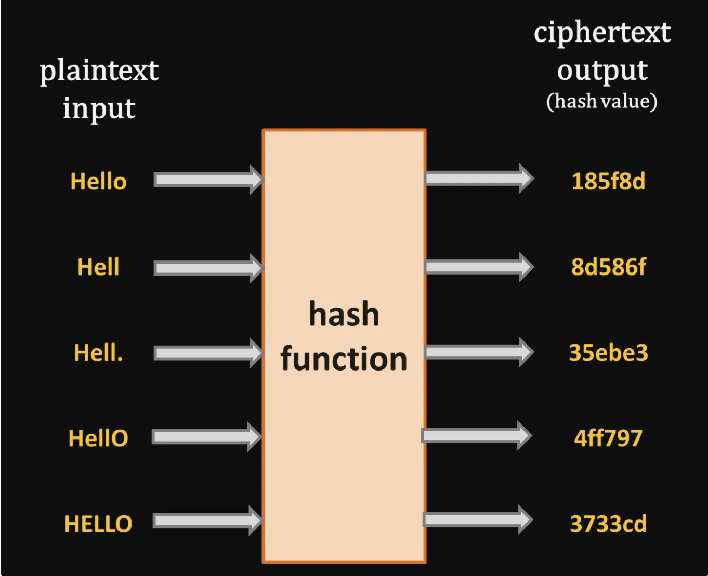
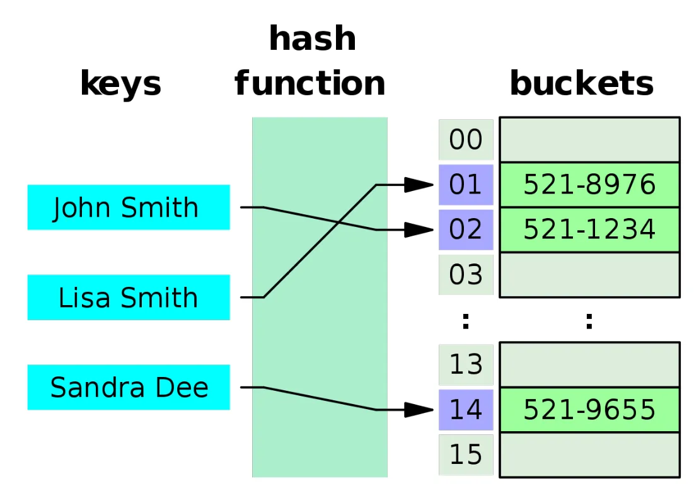
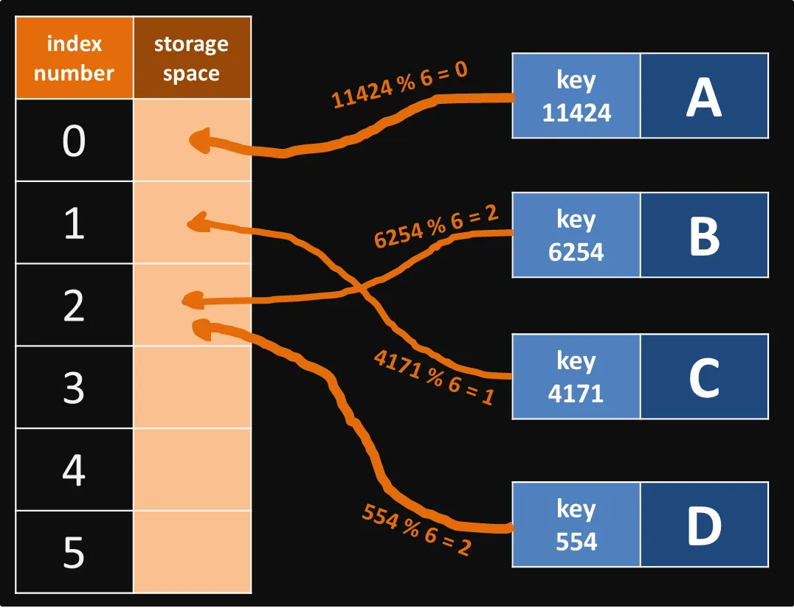
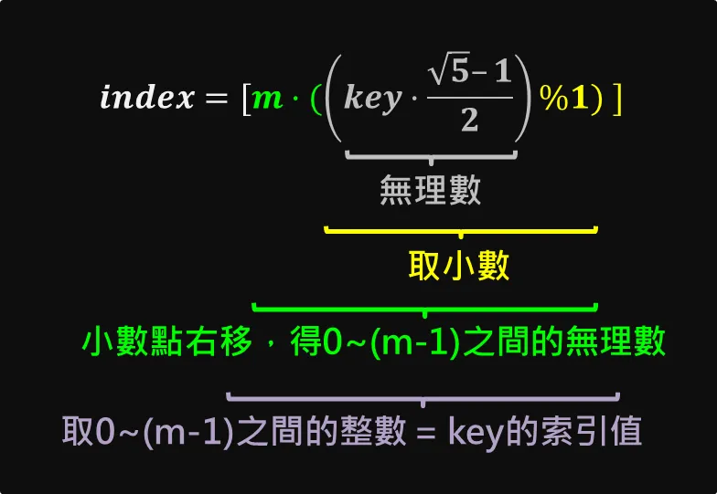
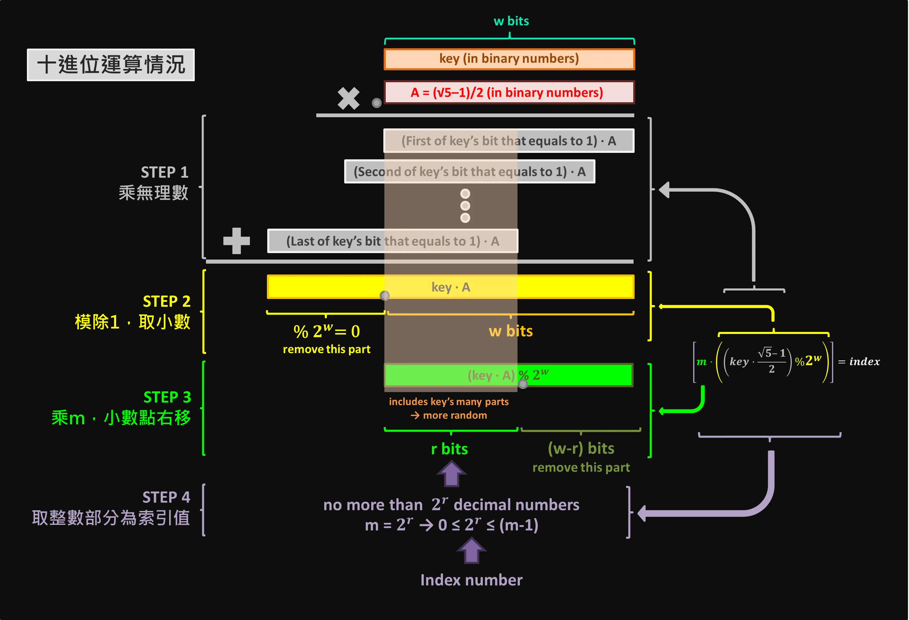
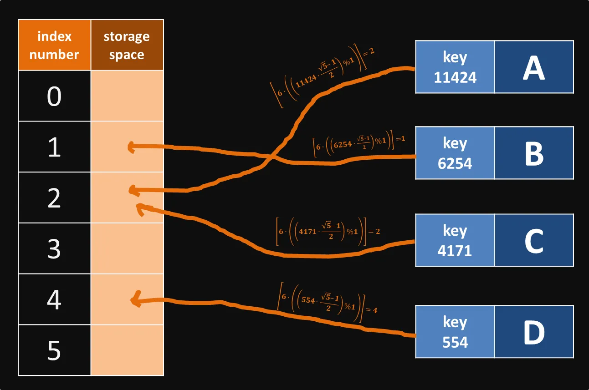
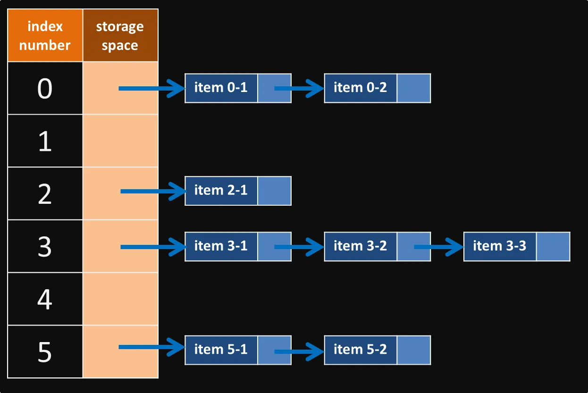
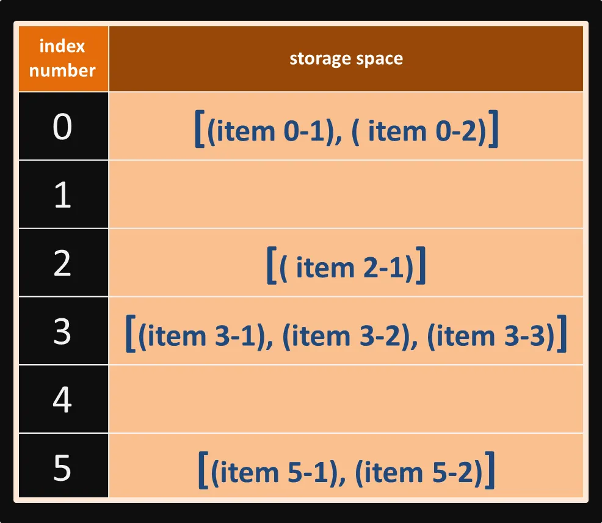
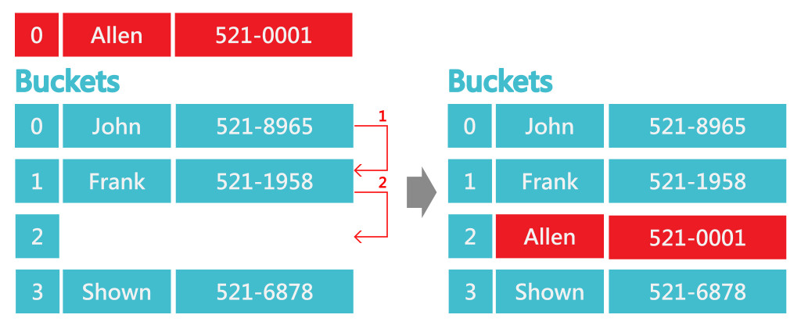
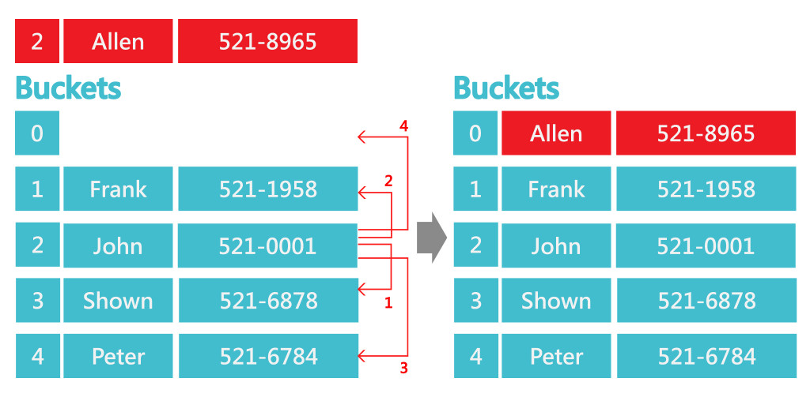

# Hash Table
「雜湊表（hash table）」，又可稱為「哈希表」，是透過鍵（key）值找到資料在記憶體位置的儲存方式。將數據透過雜湊函式（hash function）映射（map）到其在表中的對應位置後，可同步降低操作時的「空間複雜度」與「時間複雜度」。

## hash function 雜湊函式
可將我們熟悉的「明文（plaintext）」轉為長度與格式固定的「密文（ciphertext / cyphertext）。只要明文改變，密文就要跟著改變，且無法從密文反推明文。這個密文即為「雜湊值（hash value）」。

## hash function 運算方法
雜湊函式運算方法
常見的雜湊函式以 「除法」或「乘法」實現，兩者都可以透過資料的「key」值找到對應的記憶體存放位置。下列範例中，雜湊表為陣列，每筆資料的儲存位置都有對應的索引值。

「載荷因子（load factor）」代表資料個數（設為 n）與雜湊表大小（設為 m）的比例，其值越大，越容易產生多筆資料放在同一個空間的「雜湊衝突（hash collision）」現象。如果載荷因子大於 1，根據「鴿巢原理（pigeonhole principal）」，雜湊衝突將不可避免。

load factor = n/m 

---

###  1. 除法:（division method）

取雜湊表大小為 m，每筆資料在雜湊表中的索引值（index）為「key % m」，其中 0≤index<m。

index = key % m

現假設有 A(key=11424)、B(key=6254)、C(key=4171)、D(key=554) 四筆資料，雜湊表共有 6 個儲存空間，載荷因子為 4/6=66.7%。四筆資料經雜湊函式以除法運算後，可得各自對應的位置如下：

在上圖中，B、D 經過雜湊函式的模除運算後皆為 2，即會產生雜湊衝突。

使用除法進行雜湊函式運算時，「m」的值應遠離 2ᵖ，否則不管「key」值多大，當中十位數以上的數字都能夠被「m」整除，經模除運算的結果非常有限，將會產生非常多衝突。

---
### 2. 乘法（multiplication method）
取雜湊表大小為 m，每筆資料在雜湊表中的索引值（index）為「[m·(( key · A)% 1)]」，其中 0≤index≤(m–1)。

> index =[m*((key*A)%1)]

這樣的算法看似複雜，我們可以拆為下列幾個步驟一一理解：
1. 將「key」值乘上一個小於 1 的無理數 A（常用 (√5–1)/2），得一個更大的無理數。
2. 將步驟 1. 求得的大無理數模除 1，去掉整數部分，剩下小數。
3. 將 m 乘以步驟 2. 求出的小數，將小數點右移，得介於 0~(m–1) 之間的無理數。
4. 將步驟 3. 求出的無理數取高斯符號，得介於 0~(m–1) 之間的整數，這個整數就是「key」值的索引值

各步驟與原理圖示如下，為了方便觀察，當中的「key」與「A」都轉為二進制（binary），因此第 2 步驟（黃色部分）的模除項目由 1 改為 2ʷ：

跟除法相比，乘法在進行上述步驟運算時，同步將「key」中更多不同的部分都納入考量，可以提高隨機性（參考上圖中央半透明橘框部分），且 m 不再有要遠離 2ᵖ 這個限制。

現假設一樣有 A(key=11424)、B(key=6254)、C(key=4171)、D(key=554) 四筆資料，雜湊表共有 6 個儲存空間，載荷因子為 4/6=66.7%。四筆資料經雜湊函式以乘法運算後，可得各自對應的位置如下：

即便經過複雜的乘法運算，雜湊衝突依然不可避免。

---

### 處理雜湊衝突(hash collision)
常見的雜湊衝突處理方式可分為「**封閉尋址法（closed addressing / chaining）**」及「**開放定址法（open addressing）**」兩大類。

### 1.封閉尋址法（closed addressing / chaining）: 
在每個儲存空間中再生成新的子鏈狀儲存空間，可用「鏈結串列（linked list）」或「陣列（array）」實現。

> 使用「鏈結串列（linked list）」實現封閉尋址

> 使用「陣列（array）」實現封閉尋址

---
### 2.開放定址法（open addressing）
透過「探測（probing）」尋找仍未儲存資料的儲存空間，主要可分為「線性探測法（linear probing）」與「平方探測法（quadratic probing）」兩種。
- 線性探測法(Linear Probing)
假設2筆資料得出一樣的雜湊值，將以線性方式往後尋找直到有空的Bucket為止，一般來說也會視為環狀結構，若後面Bucket都滿了，可以循環到前面尋找。

- 透過 (H(x) ± i²) mod b，b為bucket數，1 ≤ i ≤ (b-1)/2，用此公式去尋找其他有空的Bucket。
第一次尋找: (H(x) + 1²) mod b
第二次尋找: (H(x) - 1²) mod b
第三次尋找: (H(x) + 2²) mod b
第四次尋找: (H(x) - 2²) mod b…...以此類推。

---
### 參考文章:[Medium:Hash Table](https://medium.com/@ralph-tech/%E8%B3%87%E6%96%99%E7%B5%90%E6%A7%8B%E5%AD%B8%E7%BF%92%E7%AD%86%E8%A8%98-%E9%9B%9C%E6%B9%8A%E8%A1%A8-hash-table-15f490f8ede6)

### 參考文章:[淺談「Hash」、「Hashtable」與「HashMap」](https://rickbsr.medium.com/%E6%B7%BA%E8%AB%87-hash-hashtable-%E8%88%87-hashmap-4e5f5e5d36da)

### 參考文章:[雜湊表Hash Table](https://ithelp.ithome.com.tw/m/articles/10268077)